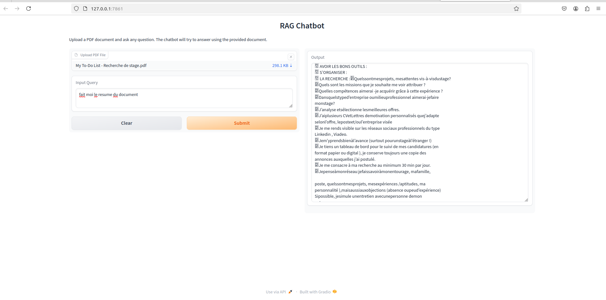

Description
Ce système RAG (Retrieval-Augmented Generation) est conçu pour traiter et répondre aux questions sur les documents liés au vin en utilisant des modèles de langage de pointe. Il combine la puissance du modèle LLaMA pour la génération de texte avec une recherche efficace de documents utilisant ChromaDB.


Voici un fichier `README.md` bien structuré pour votre projet RAG (Retrieval-Augmented Generation) :  

graph TB
    subgraph "Phase 1: Document Processing"
        A[PDF Document] --> B[Document Loader]
        B --> C[Text Splitter]
        C --> |Chunks| D[Chunked Text]
    end

    subgraph "Phase 2: Embedding & Storage"
        D --> E[Embedding Model]
        E --> |Vectors| F[Vector Database]
    end

    subgraph "Phase 3: Query Processing"
        G[User Query] --> H[Query Embedding]
        H --> I[Vector Similarity Search]
        F --> I
        I --> J[Relevant Chunks]
    end

    subgraph "Phase 4: Response Generation"
        J --> K[Context Assembly]
        G --> K
        K --> L[LLM]
        L --> M[Generated Response]
    end

    %% Styling
    style A fill:#f9f,stroke:#333
    style G fill:#f9f,stroke:#333
    style M fill:#bfb,stroke:#333
    style F fill:#bbf,stroke:#333


```markdown
# RAG Chatbot - Retrieval-Augmented Generation for PDF Documents


## Description

Le **RAG Chatbot** est une application interactive permettant de répondre à des questions en utilisant le contenu d'un document PDF fourni par l'utilisateur. Grâce à une combinaison de modèles d'apprentissage automatique et de pipelines d'ingestion de données, le chatbot analyse les documents, extrait les informations pertinentes et génère des réponses naturelles.

### Fonctionnalités :
- **Chargement de PDF** : Chargez un document PDF via une interface conviviale.
- **Questions personnalisées** : Posez des questions spécifiques sur le contenu du document.
- **Génération de réponses** : Obtenez des réponses précises grâce à un modèle de langage avancé.
- **Utilisation de Gradio** : Interface utilisateur simple et intuitive pour interagir avec le chatbot.

---

## Architecture
project_root/
├── app/
│   ├── __init__.py
│   ├── Qabot.py
├── .gitignore
├── Dockerfile
├── docker-compose.yml
├── requirements.txt
└── README.md

### Étapes principales :
1. **Chargement du document** : Le fichier PDF est chargé et analysé avec `PyPDFLoader`.
2. **Division du texte** : Le contenu est segmenté en chunks pour un traitement efficace à l'aide de `RecursiveCharacterTextSplitter`.
3. **Création de la base vectorielle** : Les chunks sont convertis en vecteurs avec `sentence-transformers/all-MiniLM-L6-v2` et stockés dans une base Chroma.
4. **Récupération des informations** : Les requêtes de l'utilisateur sont comparées aux vecteurs pour retrouver les passages pertinents.
5. **Génération de réponses** : Un modèle de langage basé sur `unsloth/Llama-3.2-1B-Instruct` génère des réponses à partir des passages récupérés.
6. **Interface utilisateur** : Une application Gradio permet de charger des PDF et de poser des questions directement.

Le schéma montre les 4 phases principales du système RAG :

Phase de Traitement du Document

Le PDF est chargé via le Document Loader
Le texte est découpé en chunks via le Text Splitter
Les chunks maintiennent un chevauchement pour préserver le contexte


Phase d'Embedding et Stockage

Chaque chunk est converti en vecteur par le modèle d'embedding
Les vecteurs sont stockés dans la base de données vectorielle
Cette phase prépare les données pour la recherche rapide


Phase de Traitement des Requêtes

La question de l'utilisateur est convertie en vecteur
Une recherche de similarité est effectuée
Les chunks les plus pertinents sont récupérés


Phase de Génération de Réponse

Les chunks pertinents sont assemblés en contexte
Le contexte et la question sont envoyés au LLM
Le LLM génère une réponse basée sur ce contexte


Cette architecture permet :

Un traitement efficace des documents
Une recherche sémantique précise
Des réponses contextuelles pertinentes
Une scalabilité du système
---

## Installation

### Prérequis :
- Python 3.8 ou supérieur
- Une machine compatible avec `torch` et les modèles pré-entraînés.

### Étapes d'installation :

1. Clonez ce dépôt :
   ```bash
   git clone https://github.com/votre-utilisateur/votre-repo.git
   cd votre-repo
   ```

2. Créez un environnement virtuel :
   ```bash
   python -m venv venv
   source venv/bin/activate  # Sous Windows : venv\Scripts\activate
   ```

3. Installez les dépendances :
   ```bash
   pip install -r requirements.txt
   ```

4. Téléchargez les modèles pré-entraînés (ils seront automatiquement récupérés lors de l'exécution).

---

## Utilisation

1. Lancez l'application Gradio :
   ```bash
   python app/qabot.py
   ```

2. Ouvrez votre navigateur à l'adresse suivante :
   ```
   http://0.0.0.0:7861
   ```

3. Chargez un fichier PDF via l'interface et posez vos questions !


---

## Exemple d'utilisation

1. Chargez un document PDF contenant des informations importantes (ex. : manuel utilisateur, recherche académique, etc.).
2. Posez une question, par exemple : _"Quels sont les points clés du chapitre 2 ?"_.
3. Obtenez une réponse générée automatiquement en fonction du contenu du document.

---

## Dépendances principales

- **LangChain** : Construction de chaînes modulaires pour l'interrogation et la récupération de données.
- **Transformers** : Modèles de langage avancés pour la génération de texte.
- **Gradio** : Création d'interfaces utilisateur interactives.
- **Chroma** : Base vectorielle pour le stockage et la récupération de données.
- **PyPDFLoader** : Chargement et lecture de fichiers PDF.

---

## Configuration

Si nécessaire, modifiez les ports ou d'autres paramètres dans le fichier `app.py` :
- **Port par défaut** : `7861`
- **Adresse serveur** : `0.0.0.0`

---

## Acknowledgements

Ce projet utilise des modèles et des outils open-source, notamment :
- [Hugging Face Transformers](https://huggingface.co/transformers/)
- [Gradio](https://gradio.app/)
- [LangChain](https://www.langchain.com/)

# ADVANCED ERRORS

- ChromaDB decrapiter
    Pour installer SQLite version 3.35.0 ou supérieure avec pip, nous devons procéder différemment car SQLite n'est pas un package Python standard. Il est généralement installé au niveau du système. Voici les étapes à suivre :

D'abord, vérifiez votre version actuelle de SQLite :

bashCopysqlite3 --version

Si vous avez besoin de mettre à jour SQLite sur Ubuntu/Debian :

bashCopysudo apt update
sudo apt install sqlite3
Si vous utilisez un environnement Python virtuel et avez besoin de support SQLite, vous pouvez installer les packages Python suivants :
bashCopypip install pysqlite3
pip install pysqlite3-binary
Si vous avez absolument besoin d'une version spécifique de SQLite, vous devrez peut-être la compiler depuis les sources :
bashCopy# Installer les dépendances nécessaires
sudo apt-get install build-essential
sudo apt-get install tcl-dev

### Télécharger SQLite
wget https://www.sqlite.org/2023/sqlite-autoconf-3420000.tar.gz
tar xvfz sqlite-autoconf-3420000.tar.gz
cd sqlite-autoconf-3420000

### cCompiler et installer
./configure
make
sudo make install

### Mettre à jour les liens dynamiques
sudo ldconfig
Pour vérifier l'installation :
bashCopy# Vérifier la version SQLite dans Python
python3 -c "import sqlite3; print(sqlite3.sqlite_version)"


```


